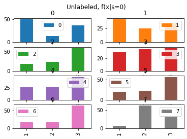
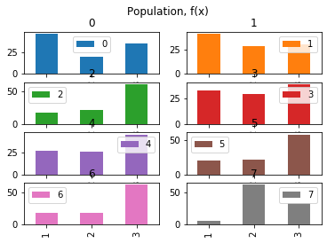
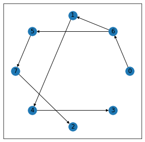

# Bayesian Classifers for PU-learning


This module contains a custom implementation of Bayesian network for **PU learning**, written from scratch in Python 3, API inspired by SciKit-learn. 
This module implements multiple Bayesian classifiers: 
* [Positive Naive Bayes(PNB)](https://doi.org/10.1016/j.patrec.2007.08.003 "PNB")
* [Positive Tree-Augmented Naive Bayes(PTAN)](https://doi.org/10.1016/j.patrec.2007.08.003 "PTAN")
* [Positive Simpler TAN(PSTAN)](https://github.com/chengning-zhang/Bayesian-Classifers-for-PU_learning "PSTAN")
* [Positive Ensemble TAN(PETAN)](https://github.com/chengning-zhang/Bayesian-Classifers-for-PU_learning "PETAN")
* [Weighted Naive Bayes(WNB)](https://github.com/chengning-zhang/Bayesian-Classifers-for-PU_learning "WNB")
* [Weighted Tree-Augmented Naive Bayes(WTAN)](https://github.com/chengning-zhang/Bayesian-Classifers-for-PU_learning "WTAN")

**PU learning** is the setting where a learner only has access to positive examples and unlabeled data. The assumption is that the unlabeled data can contain both positive and negative examples.

Note: All algorithms make the "Select Completely At Random(SCAR)" labeling assumption. 
We consider "case-control" and "single training" sampling scenariors.  

## Current features

### PU Generator
Generate Positive and Unlabeled data from fully labeled data set. 

```javascript
import PUgenerator

p450_pu = PUgenerator()
p450_pu.fit(X,y,400,800)
p450_pu.prevalence_ # 0.653
p450_pu.plot_dist() # plot all feature distributions

p450_pu.X_1abeled_  # labeled set
p450_pu.X_Unlabeled_ # Unlabeled set
p450_pu.y_Unlabeled_ # Unlabeled target values(unknown in practice)
```




### PU Bayesian classifiers
Demo for implementation of PNB and PSTAN, from training to prediction

```javascript
import PNB
pnb = PNB()
pnb.fit(p450_pu.X_1abeled_,p450_pu.X_Unlabeled_, p450_pu.prevalence_) # model fitting
pnb.predict(p450_pu.X_Unlabeled_) # prediction
pnb.predict_proba(p450_pu.X_Unlabeled_) # proba prediction

```

```javascript
import PSTAN
pstan = PSTAN()
pstan.fit(p450_pu.X_1abeled_,p450_pu.X_Unlabeled_, p450_pu.prevalence_,M) # model fitting
pstan.plot_tree_structure() # plot learned tree-structure
pstan.predict(p450_pu.X_Unlabeled_) # prediction
pstan.predict_proba(p450_pu.X_Unlabeled_) # proba prediction
```


### Evaluation
Evaluation under multiple runs, take average.

```javascript
import get_cv

Accuracy, CLL, Precision,Recall = get_cv(PNB,X,y,400,800,M)
print(np.mean(Accuracy))
print(np.mean(CLL))
print(np.mean(Precision))
print(np.mean(Recall))
```


## Built With

* [Dropwizard](https://scikit-learn.org/stable/modules/classes.html) - scikit-learn API
* [Maven](https://maven.apache.org/) - Dependency Management
* [ROME](https://rometools.github.io/rome/) - Used to generate RSS Feeds


## Versioning

We use [SemVer](http://semver.org/) for versioning. For the versions available, see the [tags on this repository](https://github.com/your/project/tags). 

## Authors

* **Chengning Zhang** - *Initial work* - [Bayesian Classifers for PU-learning](https://github.com/chengning-zhang/Bayesian-Classifers-for-PU_learning)

## License

This project is licensed under the MIT License - see the [LICENSE.md](LICENSE.md) file for details

## Acknowledgments

* Hat tip to anyone whose code was used
* Inspiration
* etc
